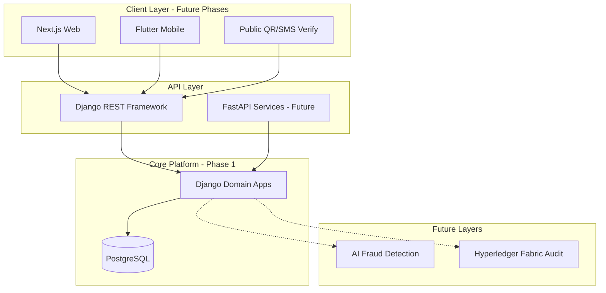

# NPTTE System Overview

## Vision

The **National Pharmaceutical Transparency & Traceability Ecosystem (NPTTE)** is a secure, modular national platform that connects regulators, manufacturers, distributors, pharmacies, logistics providers, and patients around a single source of truth for medicine identity, location, and status.

## Architectural principles

1. **Modular monorepo** — Bounded domains as Django apps; future services (FastAPI, AI, blockchain) integrate via APIs and events.
2. **Security by design** — Authentication, authorisation, audit, and encryption are first-class; no shortcuts for citizen health data.
3. **Phased delivery** — Each phase delivers testable value without blocking future capabilities.
4. **PostgreSQL as system of record** — Relational integrity for registrations, inventory, and transactions.
5. **Extensibility** — `metadata` JSON fields and stable UUID identifiers support national integrations without constant schema migrations.

## High-level context

## Core capabilities (target state)

| Capability | Primary apps | Phase |
|------------|--------------|-------|
| Identity & roles | accounts | 1 |
| Organisation registry | organisations, pharmacies | 1 |
| Product catalogue | products | 1 |
| Serialization | serialization | 1–2 |
| Inventory | inventory | 2 |
| Patient medication search | patients, inventory, pharmacies | 2–3 |
| Dispensing trace | transactions | 2–3 |
| Public verification | verification | 3 |
| Regulatory oversight | regulatory | 3 |
| Audit trail | audit, blockchain-layer | 3–4 |
| Notifications | notifications | 2+ |

## Phase 1 scope (current)

- Django project scaffold and thirteen domain applications
- Foundational models with shared base fields
- Admin interface for data stewardship
- Documentation structure
- Patient medication search **service placeholder** (no public API yet)

## Non-goals (Phase 1)

- Blockchain anchoring
- AI/ML models
- Mobile or web frontends
- Production deployment automation
- External NAFDAC system integrations

## Deployment outlook

Production will run Django behind a reverse proxy (e.g. Nginx), with PostgreSQL HA, secrets management, and environment-specific settings (`config.settings.production`). Container orchestration and IaC live under `infrastructure/` in a future phase.
